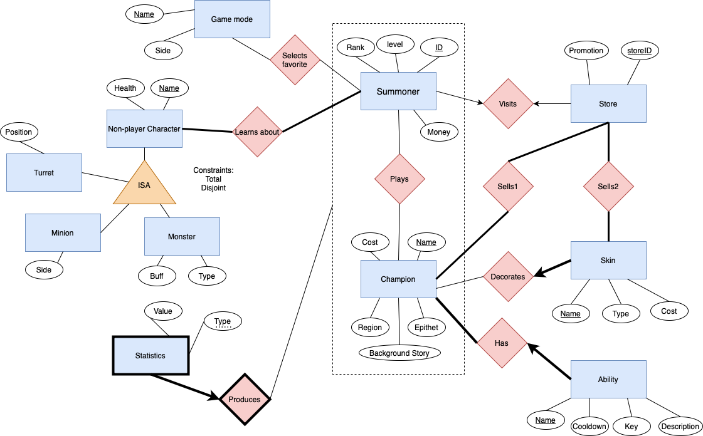

# Project Description
The domain of our application is to develop a simple game platform, which will focus on providing detailed game information of League of Legends that associate with player accounts to the summoners once they log in. The main functionality will include showing the summoner's profile, favorite game modes, champions and skins owned in account, recorded players’ statistics on the champions, learning about store information, champion’s ability, non-player characters and other in-game information.

# Diagram Improvement 

- Based on the Milestone 1, we realize that the relationship between Friend and Summoner is unary, which causes that we don’t have enough number of entities for the designed ER diagram. Therefore, we add the entity of Game Mode that has different names(primary key) and confrontation sides. Summoners can select their favorite game modes. Considering the case that some summoners don’t really have a favorite mode and some game modes can be selected by nobody(no one likes it), hence we create the relation as many to many without the participation constraint.
- We also modified some relationships and constraint this time:
    1. We add the total participation in the relationship between summoner and non-player character, since we consider that every summoner must learn about the non-player characters in order to play the game (even for beginners). Otherwise, it doesn’t make sense that players play the game without knowing the gameplay setting.
    2. We also add the total participation in the relationship for sell1 and sell2 and change the relation from “one(store) to many(champion,skin)” to “many to many”. There is the fact that every summoner has an independent store, since every summoner prefers and purchases different items. If person A purchases the itemA in store while personB doesn’t, the itemA will still exist in personB’s store. Therefore, any champion summoner can play must be in the store, and every store must sell all champions to every summoner. Similarly, it also applies to the relation between stores and skins 
- The main difference from the last time is that we reconsider the functionality of the statistics entity. Statistics are produced by the champion summoner played, it will record how many kills, how many assists, how many deaths, how much gold earned and how many roaming scores this champion got in the past game.  We used to think that the entity is just a weak entity of the champion, since it will be meaningless if the champion entity does not exist anymore. However, the fact is that the champion is selected and played by the summoners and the purpose of recording the statistics is to reflect on the performance of the summoner. Hence we make the relation between summoner and champion as the aggregation, and design the statistics entity as a weak entity of the aggregation.     

# Schema
Summoner(id: char(20), level: integer, rank: char(20), money: integer)
- primary key: id
- candidate key: none 
- foreign key: none

Game_mode(name: char(20), description: char(1000))
- primary key: name
- candidate key: none 
- foreign key: none

Non-player_character(name: char(20), health: integer)
- primary key: name
- candidate key: none 
- foreign key: none

Monster(name: char(20), buff: char(20), type: char(20))
- primary key: name
- candidate key: none 
- foreign key: name reference non-player character
- constraint: There exists a total and disjoint ISA relationship between non-player character and monster, hence monster must have a name

Minion(name: char(20), side: char(20),  type: char(20))
primary key: name
candidate key: none 
foreign key: name reference non-player character
constraint: There exists a total and disjoint ISA relationship between non-player character and minion, hence minion must have a name

Turret(name: char(20), position: char(20))
primary key: name
candidate key: none 
foreign key: name reference non-player character
constraint: There exists a total and disjoint ISA relationship between non-player character and turret, hence turret must have a name

Select_favorite(id: char(20), name: char(20))
primary key: id, name
candidate key: none 
foreign key: id reference summoner, name reference game mode

Learn_about(id: char(20), name: char(20))
primary key: id, name
candidate key: none 
foreign key: id reference summoner, name reference non-player character
constraint: All summoners must learn about the non-player characters while all non-player characters must be learned by at least one summoner. 

Champion (name: char(20), cost: integer, epithet: char(20), region: char(20), background story: char(1000))
primary key: name
candidate key: none 
foreign key: none
constraint: All champions should be sold by at least one store

Play(id:char(20), name:char(20))
primary key: id, name
candidate key: none 
foreign key: id reference summoner, name reference champion

Statistic_produced(id: char(20), name: char(20), type:char(20), value:integer)
primary key: id, name, type
candidate key: none 
foreign key:  id reference summoner, name reference champion
constraint: the statistic_produced is the weak entity dependent on the aggregation of summoner and champion

Store_visit(storeID:char(20), promotion:char(20),id:char(20))
primary key: storeID
candidate key: id
foreign key:  id reference summoner
constraint:1. All skins should be sold by at least one store, all stores should sell at least one skin  2.every summoner can visit one store

Sell1(name:char(20), storeID:char(20))
primary key: name, storeID
candidate key: none 
foreign key: name reference champion, storeID reference store
constraint: All stores should sell at least one champion

Sell2(name:char(20), storeID:char(20))
primary key: name, storeID
candidate key: none 
foreign key: name reference skin, storeID reference store
constraint: All stores should sell at least one skin

Skin_decorate(skin name: char(20), type: char(20), cost: integer, champion name: char(20))
primary key: skin name
candidate key: none 
foreign key: champion name reference champion
constraint: one champion can be decorated by many skins, every skin must decorate exact one champion

Ability_owned(ability name: char(20), cooldown: integer, key: char(20), description:(1000), champion name: char(20))
primary key: ability name
candidate key: none 
foreign key: champion name reference champion
constraint: one champion must have at least one ability, each ability belongs to exact one champion

Functional Dependencies
Summoner(id: char(20), level: integer, rank: char(20), money: integer)
id → level, rank, money

Game_mode(name: char(20), description:char(1000))
name → description

Non-player_character(name: char(20), health: integer)
name → health

Monster(name: char(20), buff: char(20), type: char(20))
name → buff, type

Minion(name: char(20), side: char(20),  type: char(20))
name → side, type

Turret(name: char(20), position: char(20))
name → position

Select_favorite(id: char(20), name: char(20))
no non-trivial FD

Learn about(id: char(20), Name: char(20))
no non-trivial FD

Champion (name: char(20), cost: integer, epithet: char(20), region: char(20), background story: char(1000))
name → cost, epithet, region, background story
epithet → background story

Play(id:char(20), name:char(20))
no non-trivial FD

Statistic_produced(id: char(20), name: char(20), type:char(20), value:integer)
id, name, type → value

Store_visit(storeID:char(20), promotion:char(20), id:char(20))
storeID → promotion, id
id → storeID, promotion

Sell1(name:char(20), storeID:char(20))
no non-trivial FD

Sell2(name:char(20), storeID:char(20))
no non-trivial FD

Skin_decorate(skin name: char(20), type: char(20), cost: integer, champion name: char(20))
skin name → type, cost, champion name
type → cost

Ability_owned(ability name: char(20), cooldown: integer, key: char(20), description:(1000), champion name: char(20))
ability name → cooldown, key, description, champion name

Normalization
Summoner(id: char(20), level: integer, rank: char(20), money: integer)
FD: id → level, rank, money
Normal form: BCNF 

Game-mode(name: char(20), description: char(1000))
FD: name → description
Normal form: BCNF

Non-player character(name: char(20), health: integer)
FD: name → health
Normal form: BCNF

Monster(name: char(20), buff: char(20), type: char(20))
FD: name → buff, type
Normal form: BCNF

Minion(name: char(20), side: char(20),  type: char(20))
FD: name → side, type
Normal form: BCNF

Turret(name: char(20), position: char(20))
FD: name → position
Normal form: BCNF

Champion (name: char(20), cost: integer, epithet: char(20), region: char(20), background story: char(1000))
FD: name → cost, epithet, region, background story
       epithet → background story
Normal Form: 2NF
Decomposition:
closure of name = {name, cost, epithet, region, background story}
closure of epithet = {epithet, background story}
we can find that epithet → background story violates BCNF

R(name, cost, epithet, region, background story)
R1(epithet, background story), R2(epithet,name,cost,region)
Final: R1(epithet, background story), R2(epithet,name,cost,region)

Normalization:
epithetBackground(epithet, background story)
primary key: epithet
candidate key: none 
foreign key: none

championBCNF(name, cost, epithet, region)
primary key: name
candidate key: none
foreign key: epithet reference epithetBackground

Statistic_produced(id: char(20), name: char(20), type:char(20), value:integer)
FD: id, name, type → value
Normal form: BCNF

Store_visit(storeID:char(20), promotion:char(20), id:char(20))
FD: storeID → promotion, id
       id → storeID, promotion
Normal form: BCNF

Skin_decorate(skin name: char(20), type: char(20), cost: integer, champion name: char(20))
FD: skin name → type, cost, champion name
       type → cost
Normal Form: 2NF
Decomposition:
closure of skin name = {skin name,  type, cost, champion name}
closure of type  = {type, cost}
we can find that  type → cost violates BCNF

R(skin name,  type, cost, champion name)
R1(type,cost), R2(type, skin name, champion name)
Final: R1(type,cost), R2(type, skin name, champion name)

Normalization:
typeCost(type, cost)
primary key: type
candidate key: none 
foreign key: none

skinDecorateBCNF(skin name, type, champion name)
primary key: skin name
candidate key: none
foreign key: type reference typeCost

Ability_owned(ability name: char(20), cooldown: integer, key: char(20), description:(1000), champion name: char(20))
FD: ability name → cooldown, key, description, champion name
Normal form: BCNF

Note: Since the relations of Play, Select-Favorite, Learn_about, Sell1 and Sell2 have no non-trivial FD, they are not presented in the Normalization part. 

